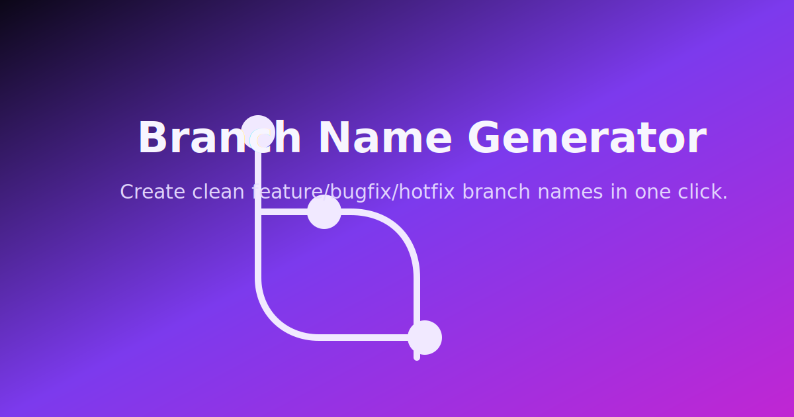

# Branch Name Generator

A fast, shareable tool to turn task titles into clean Git branch names with feature/bugfix/hotfix prefixes. Themeable, keyboard-friendly, and ready to copy in one click.



## Features
- Instant slugification of any task title.
- Prefix selectors (feature/bugfix/hotfix) with quick copy.
- Light/dark theme toggle and polished UI.
- Local history (last 3 copies) with one-click reuse.
- Responsive and keyboard-friendly; accessible landmark structure.

## Live Demo
https://korotinmain.github.io/branch-name-generator/

## Quick Start
```bash
npm install
npm test         # run Jest tests
npm run build    # bundle to dist/ for GitHub Pages
```

Open `index.html` or `dist/index.html` in your browser after building.

## Development
- Entry: `index.html`, `style.css`, `main.js`
- Tests: `tests/main.test.js` (Jest)
- Build: `npm run build` (esbuild bundle to `dist/`)
- Deploy: GitHub Actions workflow (`.github/workflows/static.yml`) runs tests, builds, and deploys `dist/` to Pages.

## Accessibility & UX
- Main landmark, aria-live result, focus states, and reduced-motion guard.
- Toast + button feedback for copy success/error.
- Top-right theme toggle and responsive layout.

## Contributing
Issues and PRs welcome! If you add features, please include tests (`npm test`) and run the build before shipping.
